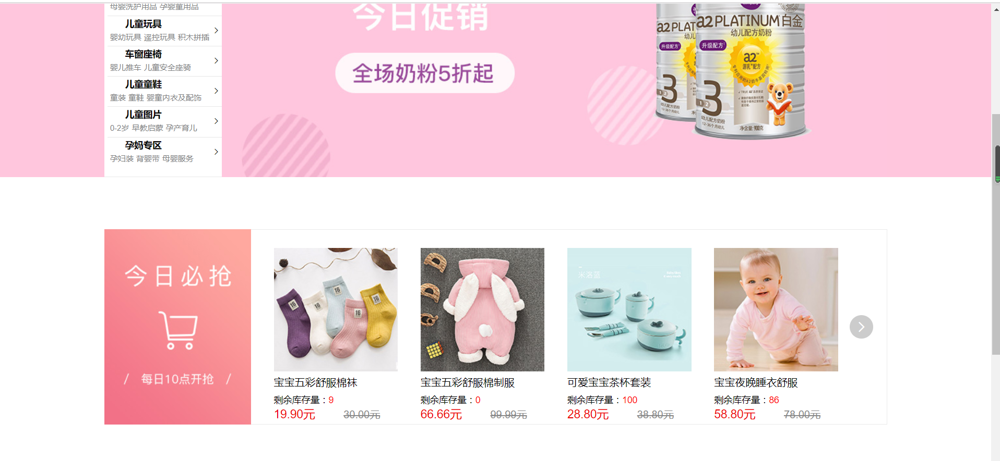
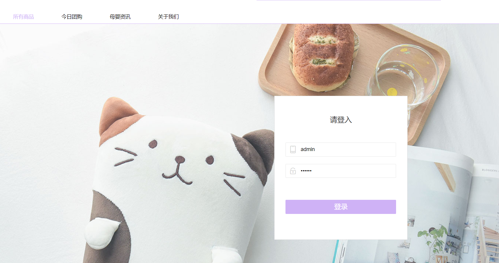
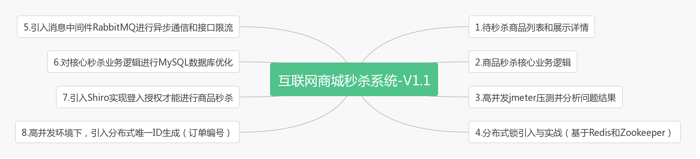
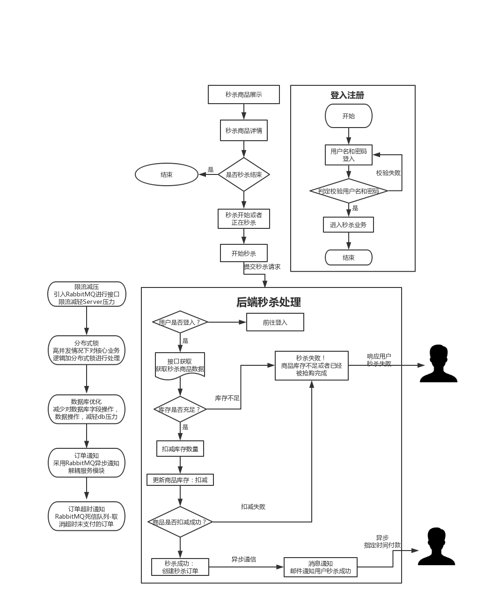

# mall-互联网商城高并发秒杀系统
### 项目介绍
mall项目是电商项目中其中的一个秒杀业务模块，基于SpringBoot+Mybatis实现。
### 项目演示

**项目首页**



**商品秒杀**


**商城登入授权**



### 组织结构

> ```
> mall
> ├── mall-common -- 工具类及通用代码
> ├── mall-mbg -- MyBatisGenerator生成的数据库操作代码
> ├── mall-kill -- 秒杀模块核心服务模块
> └── mall-kill-api -- 秒杀模块的前端实现以及api接口
> ```

### 技术选型

#### 后端技术

| 技术                 | 说明             | 官网                                                 |
| -------------------- | ---------------- | ---------------------------------------------------- |
| SpringBoot           | 容器+MVC框架     | https://spring.io/projects/spring-boot               |
| Shiro                | 认证和授权框架   | https://spring.io/projects/spring-security           |
| MyBatis              | ORM框架          | http://www.mybatis.org/mybatis-3/zh/index.html       |
| MyBatisGenerator     | 数据层代码生成   | http://www.mybatis.org/generator/index.html          |
| Hibernator-Validator | 验证框架         | http://hibernate.org/validator/                      |
| RabbitMq             | 消息队列         | https://www.rabbitmq.com/                            |
| Redis                | 分布式缓存       | https://redis.io/                                    |
| Docker               | 应用容器引擎     | https://www.docker.com/                              |
| Druid                | 数据库连接池     | https://github.com/alibaba/druid                     |
| Lombok               | 简化对象封装工具 | https://github.com/rzwitserloot/lombok               |
| LogStash             | 日志收集工具     | https://github.com/logstash/logstash-logback-encoder |

#### 前端技术

| 技术      | 说明         | 官网                                                    |
| --------- | ------------ | ------------------------------------------------------- |
| Bootstrap | 前端框架     | https://www.bootcss.com/                                |
| jQuery    | js组件库     | https://jquery.com/                                     |
| Ajax      | 前端HTTP框架 | https://developer.mozilla.org/zh-CN/docs/Web/Guide/AJAX |

### 秒杀系统要点分析图




### 秒杀业务流程图



### 环境需求安装

#### docker 安装Redis

> docker run --name redis -p 6379:6379-v /opt/docker/redis/data:/data -d redis:5.0.2 redis-server --appendonly yes

#### docker 安装Zookeeper

> docker run -d -p 2181:2181 -v /opt/docker/zookeeper/data/:/data/ --name=zookeeper --privileged zookeeper 

#### docker 安装 RabbitMQ

> docker run -d --name rabbitmq3.7.7 -p 5672:5672 -p 15672:15672 -v /mq/data:/var/lib/rabbitmq --hostname myRabbit -e RABBITMQ_DEFAULT_VHOST=my_vhost  -e RABBITMQ_DEFAULT_USER=admin -e RABBITMQ_DEFAULT_PASS=admin 2888deb59dfc

**备注：项目有任何问题可以和作者交流或者咨询作者**

作者联系方式 QQ: **1030004653**

